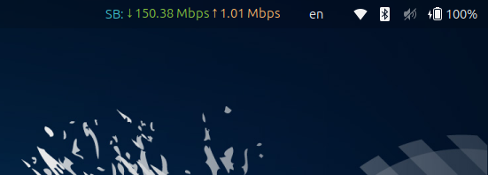
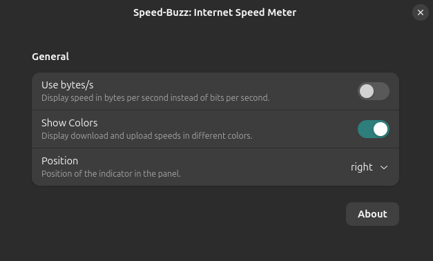

# ⇅ SpeedBuzz - An Internet Speed Meter

A simple and minimal internet speed meter extension for the GNOME Shell.

## Screenshots

| Extension Running | Settings / Preferences |
| :---: | :---: |
|  |  |

## Features

- **Real-time Monitoring:** Track your Upload and Download speeds directly in the top panel.
- **Customizable Units:** Toggle between Bits per second (bps) and Bytes per second (B/s).
- **Visual Clarity:** Optional color-coding for upload and download speeds.
- **Flexible Positioning:** Place the indicator on the Left, Center, or Right of the panel.
- **Quick Access:** Click the indicator to instantly open the settings page.

## Supported GNOME Versions

- **GNOME 45** to **GNOME 50**

## Installation

### Install from source

1. Clone this repository:
   ```bash
   git clone https://github.com/HRIDOY-BUZZ/SpeedBuzz.git
   ```

2. Change directory:
   ```bash
   cd SpeedBuzz
   ```

3. Run the install script:
   ```bash
   chmod +x ./install.sh && ./install.sh
   ```

### Enabling the Extension

After installation, you need to enable the extension:

1. **Restart GNOME Shell**:
   - On **X11**: Press `Alt + F2`, type `r`, and press `Enter`.
   - On **Wayland**: Log out and log back in (or restart your session).
2. **Enable via App**:
   - Use the [**Extensions**](https://apps.gnome.org/Extensions/) app or [**Extension Manager**](https://flathub.org/apps/details/com.mattjakeman.ExtensionManager) to toggle **SpeedBuzz** on.

## License

[GNU General Public License v3.0](LICENSE)

Copyright © 2026 Al-Amin Islam Hridoy
